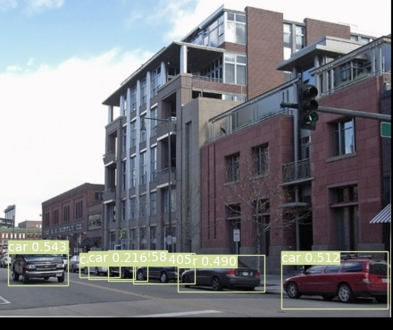
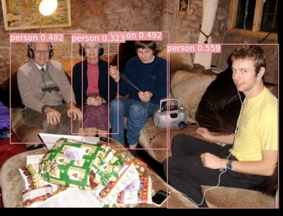

## FCOS: Pytorch Implementation Support PASCAL VOC and MS COCO
RetinaNet code which is similar with this repo :https://github.com/ChingHo97/RetinaNet-Pytorch-36.4AP
you can find difference between the anchor free and anchor base.
###  AP Result
| PASCAL VOC (800px) | COCO(800px) |
| :-----------: | :-----------------: |
|     78.7 (IoU.5)      |      **37.2**       |

### Requirements  
* opencv-python  
* pytorch >= 1.0  
* torchvision >= 0.4. 
* matplotlib
* cython
* numpy == 1.17
* Pillow
* tqdm
* pycocotools

### Results in coco 
Train coco2017 on 4 Tesla-V100, 4 imgs for each gpu, init lr=1e-2  using GN,central sampling,GIou.


You can download the 37.2 ap result in [Baidu driver link](https://pan.baidu.com/s/1tv0F_nmwiJ47C3zJ5v_C0g), password: cnwm,then put it in checkpoint folder, then run the coco_eval.py
you can get the result as follows:
```python
Average Precision  (AP) @[ IoU=0.50:0.95 | area=   all | maxDets=100 ] = 0.372
 Average Precision  (AP) @[ IoU=0.50      | area=   all | maxDets=100 ] = 0.559
 Average Precision  (AP) @[ IoU=0.75      | area=   all | maxDets=100 ] = 0.399
 Average Precision  (AP) @[ IoU=0.50:0.95 | area= small | maxDets=100 ] = 0.207
 Average Precision  (AP) @[ IoU=0.50:0.95 | area=medium | maxDets=100 ] = 0.410
 Average Precision  (AP) @[ IoU=0.50:0.95 | area= large | maxDets=100 ] = 0.495
 Average Recall     (AR) @[ IoU=0.50:0.95 | area=   all | maxDets=  1 ] = 0.311
 Average Recall     (AR) @[ IoU=0.50:0.95 | area=   all | maxDets= 10 ] = 0.503
 Average Recall     (AR) @[ IoU=0.50:0.95 | area=   all | maxDets=100 ] = 0.553
 Average Recall     (AR) @[ IoU=0.50:0.95 | area= small | maxDets=100 ] = 0.358
 Average Recall     (AR) @[ IoU=0.50:0.95 | area=medium | maxDets=100 ] = 0.597
 Average Recall     (AR) @[ IoU=0.50:0.95 | area= large | maxDets=100 ] = 0.687
```
### there are some details you neet to notice:
as for the data-augument, I only use flip, color jitter and rotate ,the random crop I also use for my training, but the ap is lower.
so I suggest you turn off the random crop.

do NMS the scores needs to sqrt, which reference to the offical.

the offical use BGR to training and pixel is not normalized to 0~1 , I use RGB and do the normalization.

### Results in Pascal Voc
Train Voc07+12 on 2 Tesla-V100 , 8 imgs for each gpu, init lr=1e-2  using GN,central sampling,GIou.  

You can download the 78.7 ap result in [Baidu driver link](https://pan.baidu.com/s/1aB0irfcJQM5WTlmiKFOfEA), password:s4cp, then put it in checkpoint folder, then run the eval_voc.py and
you can get the result as follows:
```python
ap for aeroplane is 0.8404275844161726
ap for bicycle is 0.8538414069634157
ap for bird is 0.8371043868766486
ap for boat is 0.6867630943895144
ap for bottle is 0.7039276923755678
ap for bus is 0.8585650817738049
ap for car is 0.8993155911437366
ap for cat is 0.919100484692941
ap for chair is 0.5575814527810952
ap for cow is 0.8429926423801004
ap for diningtable is 0.6596296818110386
ap for dog is 0.8896160095323242
ap for horse is 0.8436443710873067
ap for motorbike is 0.8114359299817884
ap for person is 0.8525903122141745
ap for pottedplant is 0.47628914937925404
ap for sheep is 0.8257834833986701
ap for sofa is 0.7000391892293902
ap for train is 0.8664281745198105
ap for tvmonitor is 0.8186715890179656
mAP=====>0.787
```
I also use the cosine lr to train the voc, and it got 76.7mAP, which is lower than linear. I think the cosine lr matches Adam is better.
### train for coco
You can run the train_coco.py, train 24 epoch and you can get the result. You need to change the coco2017 path.
### train for PASCAL VOC
You can run the train_voc.py, train 30 epoch and you can get the result. You need to change the PASCAL07+12 path, you can reference to this repo:https://github.com/YuwenXiong/py-R-FCN

### Detect Image   
You can run the detect.py to detect images , this repo provides PASCAL VOC Images detection demo.
  
  

thanks to [@VectXmy](https://github.com/VectXmy), I referenced some codes.
